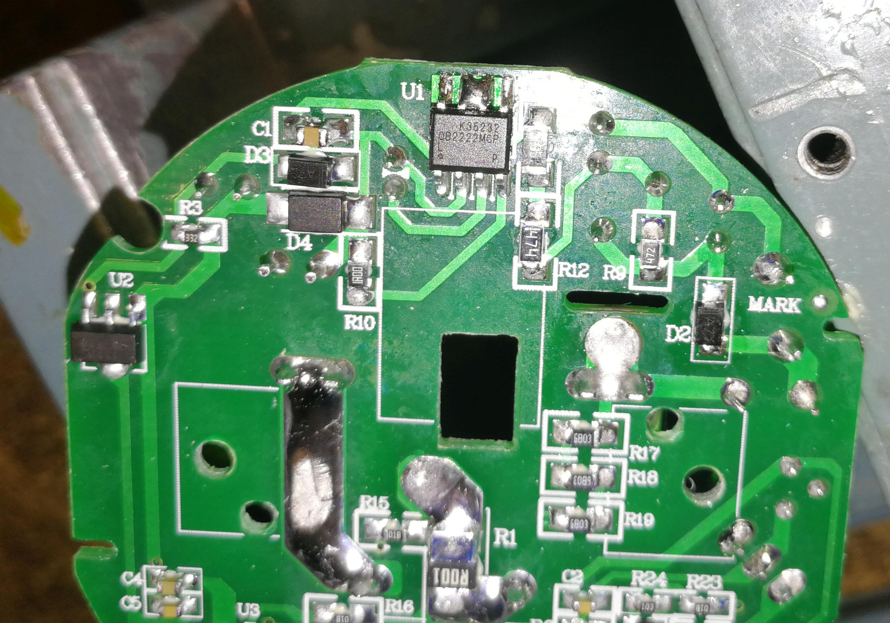

# Hykker SE-0792

## Info

:warning: :warning: :warning:

I hope you know it's dangerous to mess with directly powered devices from main AC line (230V~) , if you don't know what to do, don't so it (nor don't bother me too).

:warning: :warning: :warning:

## Power socket

This is reverse engineered schematic of smart power socket with energy consumption measurement ( Hykker SE-0792 ). This "annoying to open" device can be bough in Polish :beetle: ( Biedronka :wink: ).

This smart socket is equipped with small custom WIFI module with ESP8266 & 25D80 (8Mbit/1MByte) dataflash.

You can flash it with [Tasmota](https://github.com/arendst/tasmota/) , [ESPEasy(mega)](https://github.com/letscontrolit/ESPEasy) or other firmwares that works on ESP8266 (HomeAssistant, etc. ...). 

In file [sch-hykker-se0792.pdf](sch-hykker-se0792.pdf) you'll find schematic.

On photo (```hykker-pcb-IOs.png```) is added pinout description: 
 

# Some Photos

## Chassis


## ESP Module


## PCB





## The Tools :sweat_smile:

And the tools used to open this 
:sweat_smile: :rofl: :rofl: :rofl: 


# EOF
.